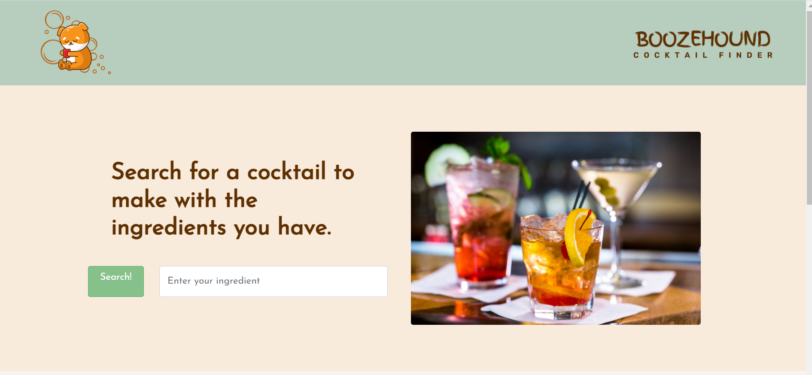

# boozeHound

## Description:

A web based application that will allow a user to search for a drink recipe based on the ingredients they have available.
The application will provide a recipe from the bartender API and a tutorial video from the youtube API to help the user make their cocktail.

User Story:
As an AMATEUR BARTENDER,
I WANT to view recipes and tutorials based on the ingredients I have,
SO THAT I can prepare a delicious cocktail for myself and my guests.

Acceptance Criteria:
GIVEN I would like to create a cocktail,
WHEN I search for cocktails or ingredients,
THEN I am presented with one or more cocktails that can be made using ingredients at hand.
WHEN I search for a tutorial on how to mix the cocktail recipe,
THEN

## Usage

Input ingredients to receive a list of up to 5 cocktails with that ingredient.
Click on one of the 5 results to recieve a YouTube Video on how to make the cocktail you selected.

## Technologies

1. HTML
2. CSS
3. JAVASCRIPT
4. BOOTSTRAP
5. JQUERY
6. YOUTUBE DATA API
7. COCKTAIL DATABASE API

## Links

Website
http://mg1919.github.io/boozehound

APIs
https://www.thecocktaildb.com/
https://developers.google.com/youtube/v3

## Images

## Licences

None
